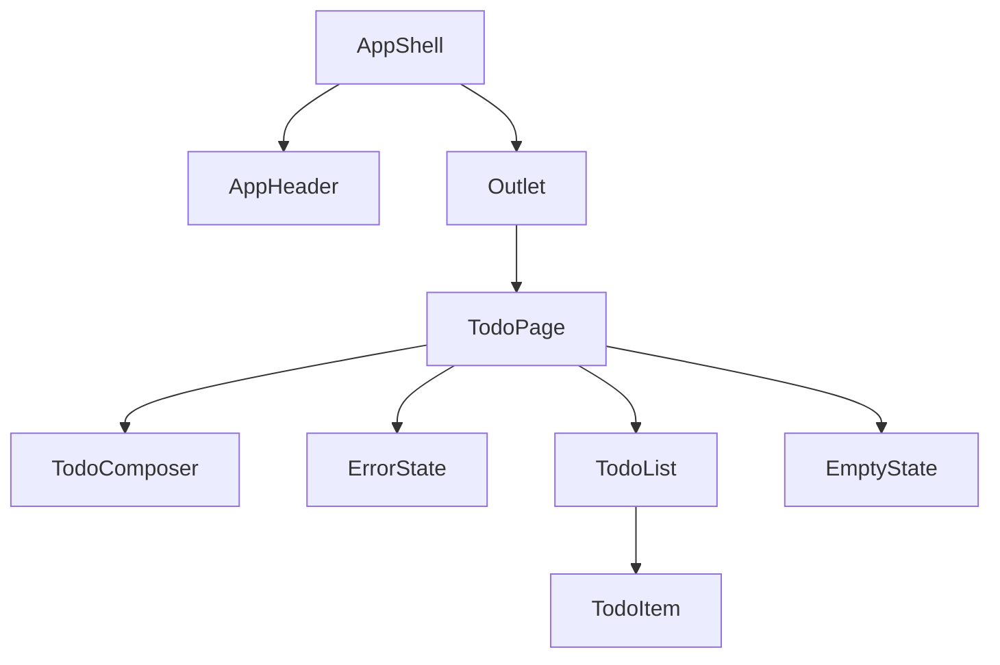

# Component inventory and architecture

## Information architecture

- **Single primary view**: todo list experience at route `/`.
- **App shell** wraps all routes: global header, scrollable main, optional footer.
- **Future-friendly routing**: React Router **layout route** at `/` with an **index** child so additional routes can be added later without restructuring the shell.

## User flows

1. **Add todo**: User focuses the composer field, types a title, presses Enter or activates Add; a new row appears at the top (or bottom—implementation picks one consistently; spec: **top** for recency).
2. **Toggle complete**: User activates the completion control on a row; the completed flag flips and the title style updates.
3. **Delete todo**: User activates Delete on a row; that todo is removed immediately.
4. **Empty list**: User deletes the last todo; the list region is replaced by **EmptyState** messaging (only when not in error).
5. **Simulated error**: User activates **Simulate error** in the header tools; **ErrorState** replaces the main todo content with a message and **Retry**; todos remain in memory. **Retry** clears the error and restores the previous view.

## Component hierarchy



Notes:

- **ErrorState** and the list or **EmptyState** are **mutually exclusive** in the main panel when `error` is set; when there is no error, show **TodoList** or **EmptyState** depending on count.
- **AppHeader** hosts the product title, optional subtitle, and the **Simulate error** control for the prototype.

## State model

```ts
type Todo = {
  id: string
  title: string
  completed: boolean
  createdAt: string // ISO timestamp
}

type TodoAppState = {
  todos: Todo[]
  error: string | null
}
```

- New ids: `crypto.randomUUID()`.
- Initial todos: imported **seed** list for a non-empty first paint; learners can delete down to empty.
- Reducer actions: `ADD`, `TOGGLE`, `DELETE`, `SIMULATE_ERROR`, `CLEAR_ERROR`.

## Files (implementation map)

| Area        | Responsibility                                      |
| ----------- | --------------------------------------------------- |
| `AppShell`  | Page frame, `Outlet` for nested routes              |
| `AppHeader` | Brand row + simulate-error control                  |
| `TodoPage`  | Reducer, conditional Empty / Error / List           |
| `TodoComposer` | Controlled input + Add button                    |
| `TodoList`  | Maps todos to `TodoItem`                            |
| `TodoItem`  | Complete toggle, title, delete                      |
| `EmptyState`| Zero todos, no error                                |
| `ErrorState`| User-visible failure + Retry                        |
